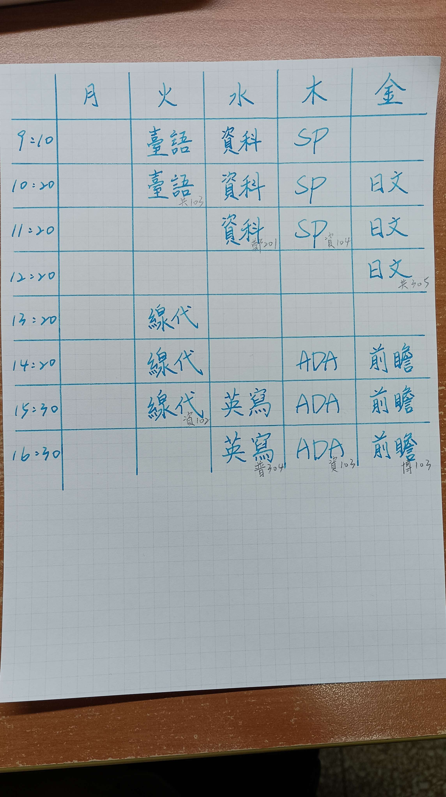

+++
title = "週休三日而品味生活"
description = "讓我體驗週休三日的集中課表"

[taxonomies]
categories = ["Journal"]
+++

## 選課

先來說說選課吧，這學期選到的課有這些，總計是 19 學分：

- 農村生活臺語會話（2）：練習說台語，沒有考試。
- 線性代數（3）：很數學，需要熟悉證明，100% 考試分。
- 資料科學概論（3）：輕鬆（對資工學生）的 Python 資料科學應用課程。
- 英文專題寫作（3，退選）：全英文授課，練習寫研究專題，用不到就退了。
- 英文段落寫作（2）：段落的結構，如何寫出好段落。
- 系統程式設計（3）：用 Unix 提供的服務寫一些系統程式。
- 演算法設計與分析（3）：很數學，需要熟悉證明，100% 考試分。
- 日文二上（3）：就是日文。
- 前瞻資訊科技一（3，旁聽）：每個教授花兩週簡介自己的研究領域，寫作業沒什麼幫助就退了，轉成旁聽。

## 生活

首先是週休三日，從上面的課表可以看到我禮拜一沒有課，這是刻意排的，想要體驗看看週休三日。週休三日加上少少的學分，讓我相較於爆肝的大一生活擁有了更多空閒時間。有關這些時間，我目前規劃週休三日其中一天要到臺北的各個角落逛逛，以及多學一些技能或知識，例如像素畫、設計模式、離散數學等等，盡量包含到課外的主題。

接著是圖書館，這學期圖書館的一樓經過長久的整修終於重新開放了，我最喜歡的是放了很多組桌椅以及布織沙發的輕閱讀區。輕閱讀區周圍有整牆的書，從牆的一端延伸到另一端，這些書都是在各大書店都能看到的新書，且全都有書套保護。這些書只能在該區閱讀，是缺點也是優點，通常我去那邊都會有書可以看，不會被借走。很多同學都會在輕閱讀區唸書（寫作業打報告之類），大約只有一成會從書架上拿書來看，我也是其中一員。不論是坐在沙發上或是坐在一般椅子上倚著桌子看書，都是一大享受。

最後是社團，這學期我打算加入兩個社團，分別是多國語言會話社以及西洋棋社。

多國語言會話社簡稱多語社，在第一次的迎新中，每個人會拿到一張問題集，要自己任意找人來互相問問題集中的其中一個問題。在這過程中我遇到各種不同的人，來自印尼的動漫宅宅、德國的六國語言人才、言行舉止有氣質的女同學，像是從模擬市民遊戲走出來的同學、以及高職一年級的女生。我選中的對象英語口說能力都不錯，達到母語人士流暢對話的程度，反觀我組織一個句子都稍嫌困難，我可以保證我沒有捧高他人或是裝弱，這些都是客觀的陳述。來了這次迎新後我對於語言學習的定義有所改變了。

西洋棋社開在週六下午，第一次的社課連續輸了兩把，第一把是輸給高手，第二把輸給比我強一點的新手，還挺挫折的。此外也認識了一位學長，西洋棋下得不錯，更重要的是他臉上總掛著微笑，後來還有互加 FB 和 Chess.com，目前我們正在下一天一手的通訊棋，肯定又要輸了吧！