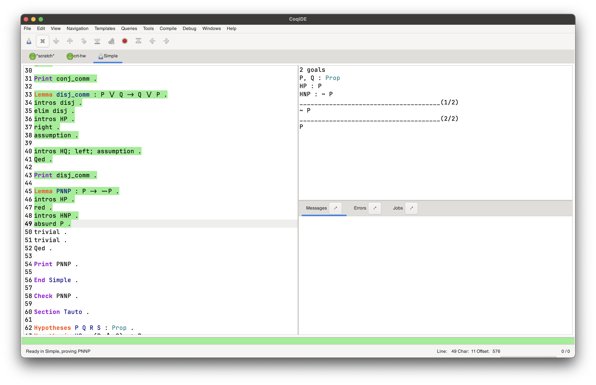
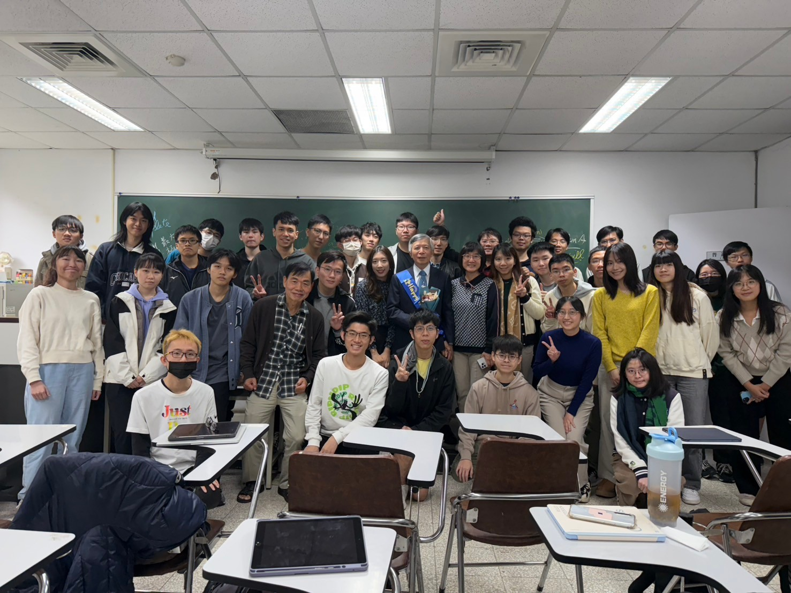
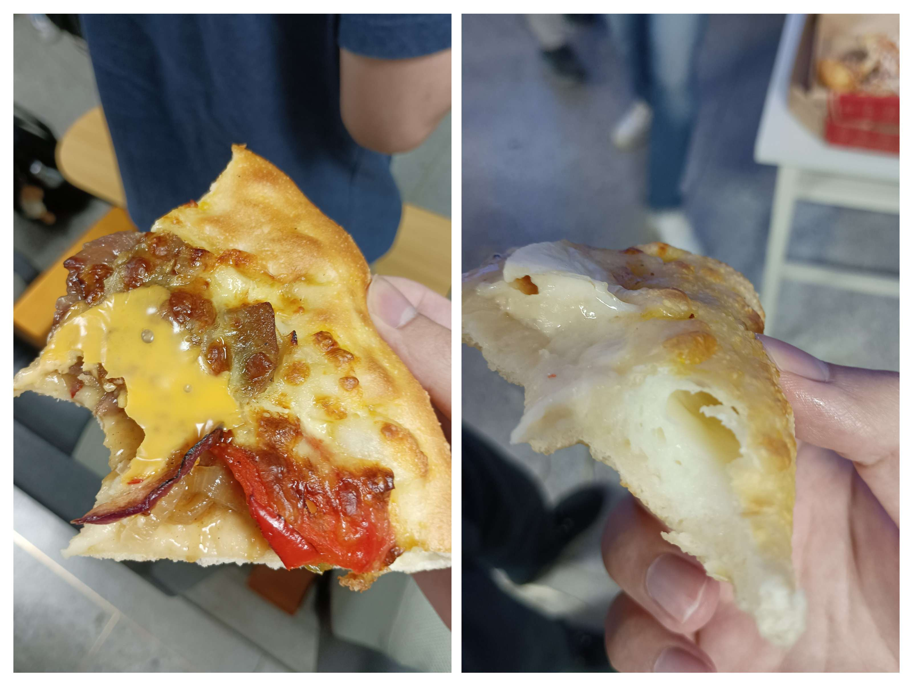

+++
title = "大三上修課心得"
description = "每一堂課的心得與優缺點"

[taxonomies]
categories = ["Journal"]
+++

這學期我過得很充實，在課業負擔上拿捏地恰到好處，適當的課程量讓我能夠充分利用時間學習而又不至於被壓地喘不過氣。這學期總共修了 19 學分的課，其中有 9 學分的必修、6 學分的系上選修、3 學分的一般選修以及 1 學分的體育，除此之外我還旁聽了一門 3 學分的系上選修。

- 林忠緯 自動機與形式語言｜必修｜3 學分
- 洪士灝 計算機結構｜必修｜3 學分
- 蔡嘉穎 德文一上｜一般選修｜3 學分
- 王柏堯 計算邏輯簡介｜系上選修｜3 學分
- 逄愛君 計算機網路｜必修｜3 學分
- 陳健輝 離散數學｜系上選修｜3 學分 旁聽
- 李濬屹 平行程式設計｜系上選修｜3 學分
- 趙曉涵 網球初級｜體育｜1 學分

這 19 學分中只有必修的 9 學分和體育 1 學分是初選就選到的，選修的「計算邏輯簡介」是我為了填補週三上午空檔在加選階段選下的課，意外地很有收穫；「平行程式設計」則是因為有朋友想要修，且課程內容讓我覺得很有意思所以透過授權碼選上的，代價是退選同一時段的高等編譯器，也是我很想修的一門課；「德文一上」是為了完成今年的目標而選下的課，在選課系統上搶不贏大一新生，在最後採用人工加簽方式才簽到。

至於旁聽的課程「離散數學」，除了名額少選不上之外老師還不開放加簽，考慮到我已經從大一選到大三，擔心以後可能沒機會修課或旁聽，所以最後我選擇了旁聽這門課。

這學期除了課表上的課程之外，我還會研究程式語言，特別是關於編譯器理論我讀了 [Crafting Interpreters](https://craftinginterpreters.com) 的直譯器章節。

## 評分量尺

這裡的三星是正常的意思，不是韓國企業，相當於一般人說的四分。除了極力推薦或極度不推薦，否則不會給一星或五星。

## 林忠緯 自動機與形式語言

> 週一 10:20 ~ 13:10｜必修｜學分 3

- 綜合：★★★★☆
- 甜度：★★★★☆
- 涼度：★★★★☆
- 紮實：★★★★☆

**上課方式**：老師使用自製的投影片上課，內容從《Introduction to the Theory of Computation》擷取，使用全英文授課。上課錄影會在當天下午上傳至 NTU COOL 及 YouTube。

**評分方式**：總共有三次考試，前兩次各佔總成績 30%，期末考佔 40%，考試前老師會公布考試涵蓋的主題，可以很容易地針對主題準備考試，因此不會很困難。另外有三次不計分的作業分別對應到三次考試範圍，都是課堂例題的延伸，一份作業只要花兩三個小時就能做完。

**心得**：基本上我依賴課程錄影來學習，一方面時間比較有彈性，另一方面是老師的語速較慢，透過影片來學習可以自由調整速度。老師對課程內容的講解淺顯易懂，在大部分情況下聽過一次就能理解，搭配作業可以有效加深印象。令人讚嘆的是教學團隊的批改速度，作業有時在截止後的兩小時內就批改完成了，其中還有附帶批改回饋；考試的批改也都是在幾天之內完成，要知道作業和考試有大量的手寫題與畫圖題，這麼快的批改速度實在不容易。

關於內容，這堂課介紹了基礎計算理論，包括了有限狀態機、圖靈機、P 與 NP 等專業資訊背景的人所必備的知識。內容在實際的應用上比較不明顯，就我所了解它應用於編譯器實作（scanning 使用 context-free language）以及演算法設計中（計算邏輯簡介課程中的 LTL model checking 演算法使用有限狀態機），這對於我學習程式語言與編譯器理論有很重要的幫助，是我修課前沒想過的意外收穫。

## 洪士灝 計算機結構

> 週二 9:10 ~ 12:10｜必修｜學分 3

- 綜合：★★★☆☆
- 甜度：★★★★☆
- 涼度：★★★☆☆
- 紮實：★★★☆☆

**上課方式**：使用教科書《Computer Organization and Design RISC-V》（白算盤）出版方提供的投影片，中間休息時間不固定，下課時間偶爾延後。

**評分方式**：兩次考試各佔學期總成績 30% 與 40%，題型都是簡答題與計算題，閱讀題組會出現最新的科技報導，有很多專有名詞對於平常沒接觸的同學會比較困難一點，但也能看出老師對同學們的期待比較高。作業與隨堂考佔 30%，作業手寫部分是簡答題與計算題，是關於基本概念的問題，程式部分用 RISC-V Assembly 寫快速排序和用 Verilog 寫簡單的 ALU 與 CPU 邏輯，按照作業規格耐心寫就能得到高分。下課之前的隨堂考用來點名，題目是當天的上課內容且可以參考投影片作答，印象中只考了兩次。

**心得**：由於我對電腦硬體稍有了解，因此這堂課的內容對我而言算偏簡單，不過還是從中學到了一些重要的概念，特別是 Pipeline 的實作方式。上課的部分老師常常會將話題轉到最新的研究上，不確定是想要讓我們了解最新發展還是純粹是老師喜歡講，補充課外內容我覺得很好，但課內內容偏少，老師上課的節奏也偏慢。會這麼說的原因是我有看過課本，課本與投影片的內容密度有不小的差距，老師上課只講解了投影片的內容，沒有課本中的重要細節，猜測是出版方為了讓課本適用於一學期課程或是顧慮到著作權所做出的取捨。作業的程式部分我覺得很有趣，難度不高卻又能做出真正能夠運行的程式，非常有成就感。

## 蔡嘉穎 德文一上

> 週二 13:20 ~ 15:10｜系外選修｜學分 3

- 綜合：★★★★☆
- 甜度：★★★★☆
- 涼度：★★★★☆
- 紮實：★★★★☆

**上課方式**：使用的課本為《Netzwerk Neu A1.1》，老師會講解課本以及補充的內容，遇到對話時會讓同學兩兩練習，可以充分練習口說。

**評分方式**：經過期中調整後，平時成績佔 20%、期中考佔 35%、期末考佔 20%、期末影片佔 25%。期中考是很標準的語言課考試，不外乎是填空、重組、問答，期末考採線上測驗，有填空題和閱讀測驗，兩者的難度我覺得都沒有明顯的放水。期末影片是要用德文拍一支影片，主題有我的日常（1 人，5-8 分鐘）和德國料理製作（1-4 人，10-15 分鐘）等選擇。平時成績沒有明確標示但我想應該是作業和小考，作業只有一次，要念稿讓 AI 辨識成功，小考則有實體與線上測驗，實體考試都是填空題，線上測驗則是採和期末考一樣的形式。

**心得**：學期初時上課氣氛超嗨，看得出來大一同學都很有熱忱~~還沒被台大課業教訓過~~，唸個字母都能夠哄堂大笑，我覺得是一門很有趣的課。老師講話幽默風趣，上課會補充以前在德國的各種體驗像是參加烤肉派對、被邀請參加婚禮和一些文化差異，非常有意思。不過到了期中開始介紹較複雜的文法變化、上課步調開始加速後，我逐漸覺得德文不夠規則而不符合我的價值觀，所以到後半學期我打開考試機器，只求將單字文法好好背下來以拿到好成績。

我在期中考運氣好拿到高分，但是有同學反映期中考表現不好，想要調整配分，最後老師和助教出於勤能補拙的想法，決定將平時成績中的 10% 和期末考中的 15% 抽出來新增一份期末影片作業。雖然這不會讓我的期中考成績吃虧，但令我不滿意的是老師和助教並沒有和所有學生討論就修改評分方式，這和課程大綱上承諾的並不相同。如果我在選課時看到有佔分 25% 的影片作業就不會有這段評價了，因為我不喜歡做報告專題類型的作業，我想應該要落實課程大綱所明定的「由師生雙方議定」才是正確的做法，當然沒有及時發聲也是我的過失。

總體而言這門課老師上課有熱忱，內容豐富，若認真學習一定可以學到紮實的德文。

## 王柏堯 計算邏輯簡介

> 週三 9:10 ~ 12:10｜系內選修｜學分 3

- 綜合：★★★★☆
- 甜度：★★★★☆
- 涼度：★★★★☆
- 紮實：★★★★☆

**上課方式**：使用的教科書為《Logic in Computer Science》，老師使用自製投影片與搭配板書上課。

**評分方式**：作業 50%，課程的四章中每章都會搭配一份手寫證明以及一份程式實作作業，手寫作業就是課堂中教過的例題對應的練習題，約兩題的份量；而程式作業則會根據課程內容使用不同的工具，包含使用 [SAT Solver](https://github.com/niklasso/minisat) 定義鴿籠問題、使用數學證明工具 [Coq](https://coq.inria.fr) 證明中國剩餘定理以及使用 [Z3 Prover](https://github.com/Z3Prover/z3) 證明從一段 [McCarthy 91](https://en.wikipedia.org/wiki/McCarthy_91_function) 程式碼中觀察出的性質的正確性。期中考與期末考各佔 20%，可以查看離線的紙本與電子資源，題型都是簡單的數學證明。最後 10% 是出席成績。

**心得**：內容有一階邏輯、少量二階邏輯、程式驗證以及 Model Checking，老師上課會仔細地講解投影片的每個細節，聽不懂的地方可以隨時發問，老師都願意重新解釋一次。另外每章的最後老師都會介紹一個關於該主題的數學工具，包括 SAT Solver、Proof Assistant、Model Checker 等工具，我覺得接觸新工具很有趣，尤其是解出基礎卻有點挑戰性的題目時很有成就感，只能說老師拿捏題目的難度很準確。

這門課對於數學證明的邏輯很有幫助，在學習的過程中可以訓練如何嚴謹地一步一步推向結論，以及了解不同的邏輯表達的差異。另外這門課也意外地對我學習程式語言理論很有幫助，上課的內容都和程式語言理論密切相關。對於程式語言有興趣的同學，我會極力推薦這門課。

附圖：數學證明工具 Coq

## 逄愛君 計算機網路

> 週三 14:20 ~ 17:20｜必修｜學分 3

- 綜合：★★★☆☆
- 甜度：★★★★☆
- 涼度：★★☆☆☆
- 紮實：★★★☆☆

**上課方式**：使用的教科書為《Computer Networking: a Top Down Approach》，上課時老師使用出版方提供的投影片。

**評分方式**：作業 40%，包括了問答題與程式題，第一次的程式題是手刻 HTTP 伺服器，這份作業雖然時間充足，但依然是個複雜的作業，因此約有 10 人在此次作業後停修；第二次是實作 reliable transfer，這次有給 Python 虛擬碼，用 C 語言耐心按照規格實作即可。期中與期末考各佔 20% 與 30%，題目都是問答題，大多問名詞解釋與優缺點比較，如簡述 DNS 運作原理此類的問題。課堂參與佔 10%。

**心得**：首先是老師的姓氏唸作「旁」，這可能是每個人第一次看到這個字，更不用說作為姓氏出現。我在大一下修過了 NASA（網路管理與系統管理），因此這堂課的內容大部分都有概念了，所以對我而言是簡單的課。透過這堂課我學到了網路五層中的應用層、傳輸層和網路層的概念，印象最深刻的是 routing 的原理，因為我以前搞不懂為什麼我的資料可以知道怎麼走到 Google 伺服器。而作業的 HTTP 伺服器很有意思，雖然不是課程的重點，但是他作為附錄讓我學習到了 HTTP 的標頭結構，不過這們作業還是過於複雜，估計花了我超過 20 小時，因為要閱讀 HTTP 規範、處理標頭、檔案 I/O 等各種實作細節，作為計算機網路課程的作業有點超出範圍了。

老師上課的講解詳細但速度偏慢，雖說如此但老師每個禮拜還是會上完預定的進度，可以說是「預期中」地慢。但是對於不熟悉網路的同學而言，老師的講解是漸進式的且搭配許多生動比喻及實際例子，非常容易理解。值得稱讚的是用心的助教團，上課前後以及中間的下課時間都會來教室和同學聊天、回答作業和其他問題，基本上就是小型的 TA hour，課後還會在 NTU COOL 上回覆同學的問題，這是我看過最親近學生的助教團了。

整體而言這是一堂中規中矩的計算機網路課，需要花點時間寫作業，且推薦用心的助教團。

## 陳健輝 離散數學

> 週四 10:20 ~ 13:10｜系內選修｜學分 3｜旁聽

- 綜合：★★★☆☆
- 甜度：未知
- 涼度：★★★★☆
- 紮實：★★★☆☆

**上課方式**：老師使用自編的講義投影片搭配板書上課。

**評分方式**：每週小考佔總成績 40%，老師會在第三節課預留 25 分鐘考試，考上週內容的基本題。其中期末考共佔 60%，題型為數學證明。因為我只有旁聽沒有參與考試，所以甜度不清楚。

**心得**：我覺得這堂課有學到一些基礎的知識，包括排列組合技巧、集合論、圖論演算法等主題，只不過老師上課的速度比較慢，內容較少且連貫性不足，多是零碎的知識，不容易抓到重點。老師上課時偶爾會吟詩作對、思考人生，常常會偏離課程內容，到學期末時還有很多投影片內容沒上到。因此我覺得在紮實度方面略顯不足，不是很推薦這門課。不過以後也修不到這門課了，因為這學期是老師最後一學期任教，可能是因為這個這樣導致教學風格轉變。在最後一堂課時還有和老師及他的家人們拍一張大合照，能夠經歷到老師退休的大場面很難得，運氣真的很好。

另外這是第一堂讓我邊上課邊吃午餐的課，因為下課後要接著上德文，我想這種第一次也是值得記錄的。

## 李濬屹 平行程式設計

> 週五 9:10 ~ 12:10｜系內選修｜學分 3

- 綜合：★★★★☆
- 甜度：★★★★☆
- 涼度：★★☆☆☆
- 紮實：★★★★☆

**上課方式**：老師使用自製投影片上課，使用全英文授課。

**評分方式**：作業佔 50%，每份作業會對應到課程中的一個主題，總共有 5 份作業。每份作業會有公開的程式執行速度排行榜，官方說法是排行會佔小部分的成績；而程式完成後需要寫分析報告，簡述如何實作、分析執行時間等。期中期末考各佔 15%，題型是簡答題，大部分都是概念題，但有少部分關於平行 API 以及手寫程式碼的問題。期末報告佔 20%，2~3 人一組選擇有興趣的主題將其平行化，需要上台發表與繳交書面報告。

**心得**：這門課的內容包括了常見的平行程式 API 如 OpenMP、MPI、CUDA 和 AMD 的 HIP，老師上課會講解設計平行程式時需要注意的地方，作業則先是透過平行化讓程式在時間內輸出正確結果，接著應用老師上課提到的技巧讓程式跑得更快。作業雖然都要花不少時間做，但是在這過程中我收穫很多，除了熟悉了平行程式 API 外，也學到了 CPU 與 GPU 設計上與應用上的差異，CPU 像是少量的超級賽亞人在做計算，可以運行很複雜的指令；而 GPU 則是數以千計的廉價勞工做計算，雖然只能執行簡單的指令但是可以用數量優勢贏過 CPU。另外也親身體驗了計算機結構的重要知識，如快取、SIMD、prefetching 等技術能夠多大程度影響程式的執行速度。

這堂課主要為大二設計，內容都會從頭講解一次，不過老師有時候會忘記而直接帶過專業術語，例如作業系統的術語 preemptive。期中有兩次的 NVIDIA Lab，需要在課後時間到 NVIDIA 的網站上學他們的 CUDA API。那課堂剩下的時間老師繼續上他的課嗎？不是的，NVIDIA 為了提供我們學習 CUDA 的誘因，所以提供了一些經費讓我們買食物，因此課堂上就是吃披薩喝可樂。每個人都能吃 4~5 片披薩，而且還是芝心披薩，可見 NVIDIA 行銷毫不手軟，~~以至於在同學的要求下有了第二個 Lab~~。

## 趙曉涵 網球初級

> 週五 13:20 ~ 15:10｜體育｜學分 1

- 綜合：★★★★☆
- 甜度：★★★★★
- 涼度：★★★★★
- 紮實：★★★☆☆

**上課方式**：課前先看 NTU COOL 上老師預錄的動作講解影片，課程中老師會重新講解一次並帶著大家一起做，剩下的時間就分組練習。

**評分方式**：考試 40%，要考正反拍擊球以及發球，可以補考但成績上限會降低。作業 30% 包括課前影片測驗、心得與建議等，只要有做就有分。剩下 30% 為出席成績。

**心得**：整體上來說是一門甜涼的體育課，課餘時間只要看看幾分鐘的預習影片即可，沒有什麼壓力。老師考量到大家都是初學者，所以課程內容比較基礎且比較少，因此紮實度普通。這學期比較可惜的時碰到多次的假日、老師公假以及雨天，導致實際在戶外打球的次數變得很少，考試因此只考了正反拍而沒有考發球。我在這堂課學到了簡單的網球動作，不過和先前說的一樣練習的時間不夠，所以到學期末也很難和同學連續對打五顆球以上，學習效果不佳令人感到可惜。