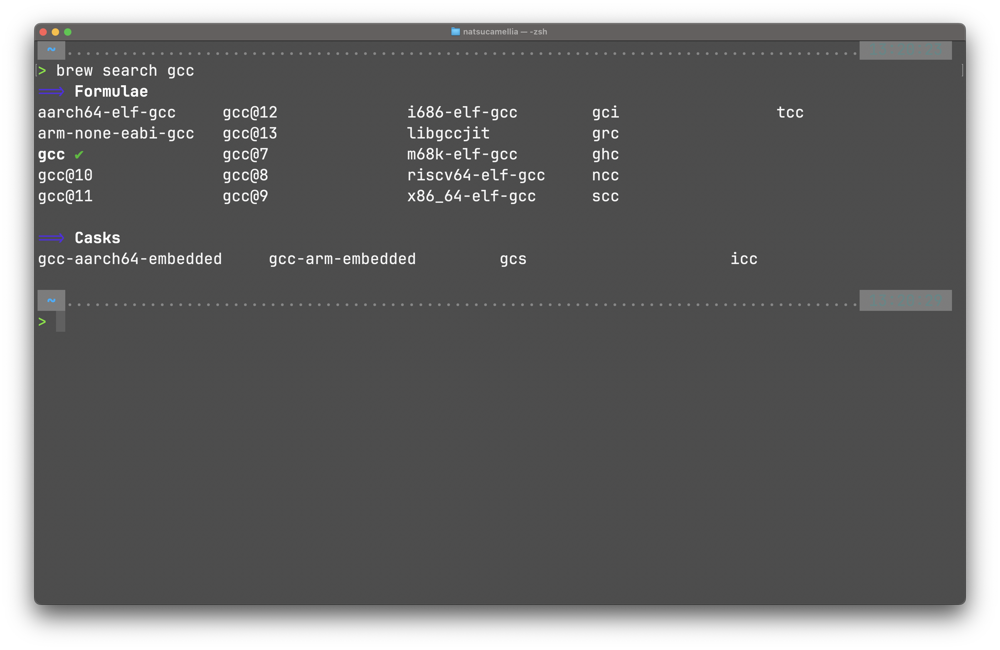
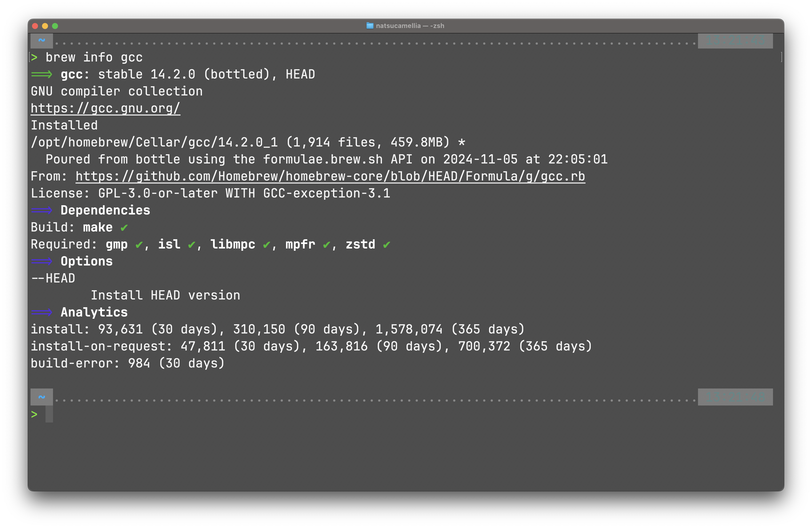
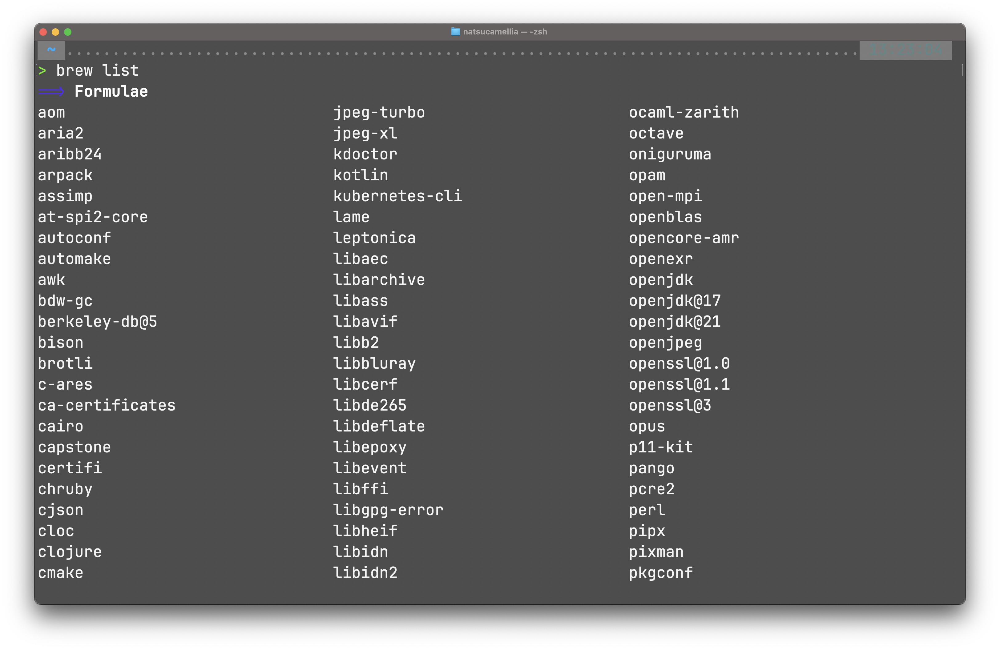
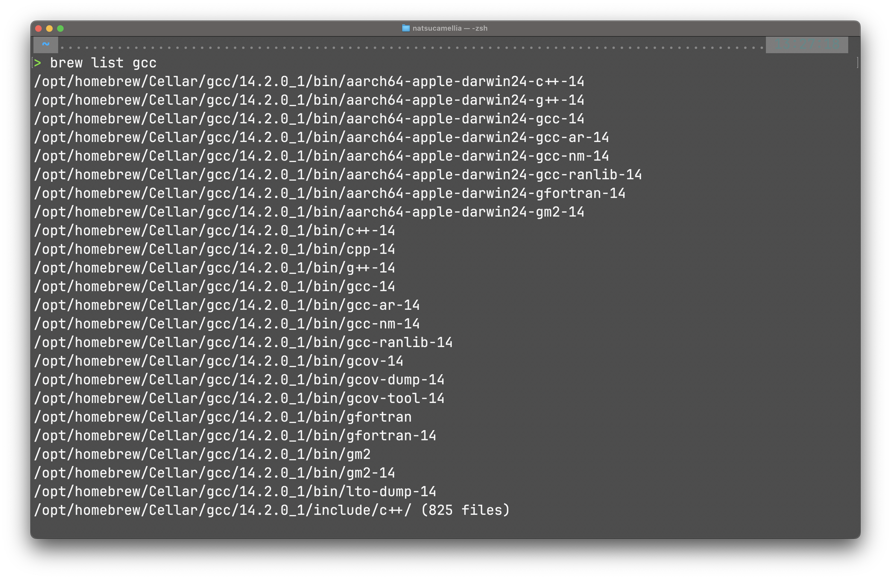

+++
title = "客製化順手的開發環境（1）——套件管理軟體"
description = "macOS 最熱門的套件管理軟體 Homebrew"

[taxonomies]
categories = ["Tutorial"]
+++

## 套件管理軟體 - Homebrew


剛拿到一台電腦要建立開發環境之前，第一步就是安裝日後必要的軟體與套件。在 macOS 上常見的套件管理軟體是 [Homebrew](https://brew.sh) 與 [MacPorts](https://www.macports.org)，而兩者之中[最多人使用的是 Homebrew](https://www.reddit.com/r/MacOS/comments/1cmiq5w/which_package_manager_do_you_use/)，也是我目前正在使用的套件管理軟體，因此本節以 Homebrew 為主要介紹對象。對於 Linux 系統只需要使用各個 Linux distro 的內建套件管理軟體即可，因為內建軟體的相容度一般來說會比較高，所以不推薦再使用其他套件管理軟體。

幾乎所有有關程式開發的函式庫、軟體都可以在 Homebrew 上安裝，因此每次我要安裝函式庫時第一步就是先檢查 Homebrew 上有沒有該函式庫，把所有東西都用 Homebrew 管理真的很舒爽。安裝 Homebrew 很容易，只需要到 [Homebrew 的網站](https://brew.sh)上複製安裝指令，並貼上至終端機執行即可，記得下載完後要在輸出文字中找到 `Next steps`，照做完成 `PATH` 設定就算是安裝成功了。

## 安裝套件

接著以安裝 GCC 為例來展示 Homebrew 的常見用法，我們先搜尋在 Homebrew 上有哪些安裝選項：（我已經安裝好 `gcc` 了所以旁邊有個勾）

> 讀者可能會有疑問，在 macOS 上可以使用 `gcc` 指令來編譯 C 程式，為什麼還要安裝 GCC？這是因為 macOS 中的 `gcc` 指令預設指向 Clang 編譯器（macOS 因為 GCC 條款問題而自行開發的 C 編譯器），如果使用 `gcc --version` 指令就能觀察到這一點。下方會告訴讀者如何將 `gcc` 指令指向 GCC 而不是 Clang。

```
brew search gcc
```



這時候會看到很多輸出訊息，我來解釋這些訊息是什麼意思。`Formulae` 中的套件通常是編譯而成、不帶有 GUI 的 CLI 軟體，如 Python、GCC；而 `Casks` 中的套件通常是透過官方網站下載的安裝包安裝而成的 GUI 軟體，如 WireShark（沒錯，WireShark 可以透過 Homebrew 安裝）。

從中可以看到 `gcc` 以及標有版本號的 `gcc@13` 等套件，`gcc` 會指向最新版本的 GCC，未來如果 GCC 更新了 GCC 15、GCC 16，`gcc` 也會自動更新上去，而 `gcc@13` 就只會停在 GCC 13。

最後我們確認一下 `gcc` 是不是我們所期望的 GCC，使用指令查看套件訊息：

```
brew info gcc
```



在輸出中可以看到套件的完整名稱 GNU compiler collection、官方網站連結、來源以及授權條款等資訊，也可以看到最近的總安裝次數。決定好要安裝的套件後，使用指令安裝該套件：

```
brew install gcc
```

此時 GCC 就安裝成功了。

## Homebrew 安裝原理

使用 `brew list` 可以看到目前已經安裝的套件以及預設安裝的套件，其中應該包含 `gcc`：（我的套件很多沒辦法完整截圖，`gcc` 在更下方）

```
brew list
```



如果要查看一個套件中的所有可執行檔：

```
brew list gcc
```



此時會輸出許多可執行檔，而其中我想要使用的 `gcc` 是：

```
/opt/homebrew/Cellar/gcc/14.2.0_1/bin/gcc-14
```

Homebrew 安裝完套件後，會將套件的指令放在 `/opt/homebrew/bin` 中，並指向真正的位置。例如我想使用的 `gcc-14` 就會位於 `/opt/homebrew/bin/gcc-14` 並指向 `/opt/homebrew/Cellar/gcc/14.2.0_1/bin/gcc-14`，使用以下指令可以驗證這一點：

```
ls -l /opt/homebrew/bin/gcc-14

// Output
... /opt/homebrew/bin/gcc-14 -> ../Cellar/gcc/14.2.0_1/bin/gcc-14
```

而 `/opt/homebrew/bin` 在安裝 Homebrew 時就已經加入 `PATH` 環境變數中了，所以我們只需要使用 `gcc-14` 就可以用 GCC 編譯 C 程式了。

簡單整理一下，當我們使用 `gcc-14` 指令時，作業系統會在 `PATH` 中尋找 `gcc-14`，此時作業系統在 `PATH` 中的 `/opt/homebrew/bin` 找到了 `gcc-14` 於是執行它，而這個 `gcc-14` 實際上指向 `/opt/homebrew/Cellar/gcc/14.2.0_1/bin/gcc-14`，所以被執行的是後者的 `gcc-14` 也就是真正安裝的 `gcc-14`。

```
gcc-14
 ↓ (OS find gcc-14 in PATH)
PATH
 ↓ (OS found gcc-14)
/opt/homebrew/bin/gcc-14
 ↓ (Links to real gcc-14)
/opt/homebrew/Cellar/gcc/14.2.0_1/bin/gcc-14
```

## 讓 GCC 指向真正的 GCC

現在如果使用 `gcc --version`，輸出依舊是 macOS 的內建編譯器 Clang。有不同方法可以將 `gcc` 指向我們剛安裝的 GCC，我這裡使用最溫和而不破壞環境的方法：`alias gcc=gcc-14`，讓 shell 在讀取到 `gcc` 指令時自動轉換成 `gcc-14`，如果想要取消的話，使用 `unalias gcc` 即可。如果要使用 Clang 編譯器的話可以使用 `clang` 指令。

其實安裝的 GCC 中也包括了 G++，可以使用相同的方法將 `g++` 指向 `g++-14`。

## 常用指令

- `brew search gcc`：搜尋名稱包含 `gcc` 的所有套件
- `brew info gcc`：查看套件 `gcc` 的訊息
- `brew install gcc`：安裝 `gcc`
- `brew uninstall gcc`：解除安裝 `gcc`
- `brew list`：列出已安裝的套件
- `brew list gcc`：列出 `gcc` 的可執行檔
- `brew update`：更新 Homebrew 套件資料庫
- `brew upgrade`：更新所有套件
- `brew upgrade gcc`：更新 `gcc`