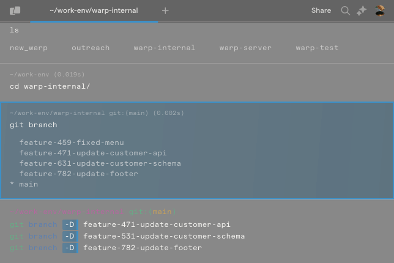
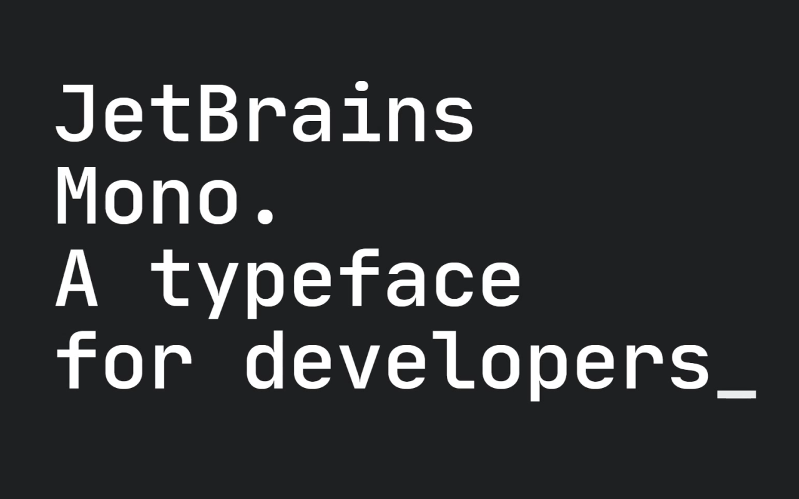
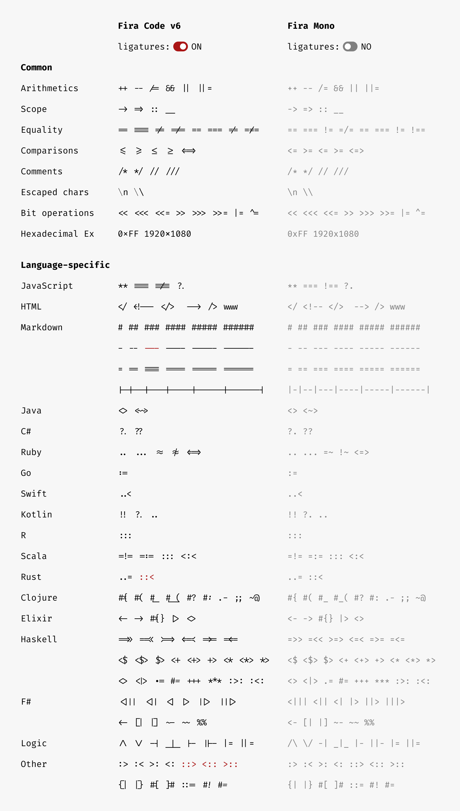

+++
title = "客製化順手的開發環境（2）——終端機與 Shell"
description = "設定美觀的介面與順眼的字體"

[taxonomies]
categories = ["Tutorial"]
+++

## 終端機與 Shell

終端機與 shell 是寫程式時不可或缺的工具，兩者關係緊密卻是兩個不同的軟體。終端機是用來裝 shell 的容器，可以將使用者的輸入傳送給 shell，也能夠將 shell 的輸出顯示在使用者的面前。而 shell 則是實際上執行工作的軟體，負責執行如 `ls`、`cd` 一類的指令，讓使用者能夠和作業系統互動。

## 終端機

現代的作業系統一般而言都會自帶終端機，在 macOS 上有 Terminal、Windows 上有傳統的 cmd 與現代的 PowerShell，而 Linux 上有 GNOME Terminal 等不同的終端機。一般來說這些終端機的功能就已經足夠強大，能夠直接用來做任何想做的事了，不過市面上也有推出更多功能的終端機，例如近年推出的 [Warp](https://www.warp.dev) 終端機，配有現代化的圖形界面，也搭配了這幾年流行的 AI，讓使用者可以在終端機內和語言模型對話。



不過因為我覺得 macOS 已經很好用了，而且不需要安裝額外的軟體，因此這篇文章著重介紹如何客製化 macOS 內建的終端機 Terminal。

首先打開 Terminal.app 並按下 `Cmd ,` 打開設定，選取「描述檔」分頁，可以看到內建多個預設的設定，不過讓我們來客製化一個自己喜歡的設定。點擊左下角的 + 號新增一個設定檔後，再按下方的「預設值」，這樣以後新開的終端機視窗都會預設使用新的設定檔。接著看看設定檔裡面的設定，我認為最需要調整的是以下設定：

1. 背景顏色：我個人把背景顏色調成黑色，並且將不透明度調成 70%，這樣就會有透明玻璃的效果，美觀又可以看到終端機後的文字。
2. 字體：下一節會介紹字體，我個人使用 JetBrains Mono Regular 字體，並且字體大小調整為 18 點，我認為終端機的字體要大一些，使用起來才會比較有效率也比較不傷眼。需要注意的是，如果如果使用的字體在顯示上有鋸齒的話，可以勾選「柔邊處理文字」讓文字更圓滑。
3. 游標：勾選「閃爍游標」可以讓終端機生動些。

以上就是 macOS Terminal 簡單的設定，用這些簡單的設定就可以讓終端機「外觀」好看不少，如果需要好看到「骨子」裡，那麼可以依照後續章節設定 shell。另外介紹一組和外觀有密切關係的快捷鍵，每當使用外接螢幕時，終端機的文字大小就可能會顯得過大或過小，這時可以使用以下快捷鍵調整：

- `Cmd +`：放大字體
- `Cmd -`：縮小字體
- `Cmd 0`：重設字體縮放

## 字體

寫程式時最「無所不在」的元素就是文字了，因此一套順眼的字體能讓我們寫程式的心情好上不少。我在這裡介紹兩個開源字體，強烈建議讀者點進連結看個幾眼，第一個是 [Fira Code](https://github.com/tonsky/FiraCode)，這是我前期所使用的字體，看起來圓滾滾的很可愛，也是我第一個使用的外部字體；另一個字體是我目前正在使用的 [JetBrains Mono](https://www.jetbrains.com/lp/mono/)，一個由 IDE 開發公司 JetBrains 所設計的開源字體，這個字體比起 Fira Code 較為細長，省略了大部分不必要的細節，因此看起來更加整潔。




這兩個適合用來寫程式的字體的特色是連字（Ligature），這個功能會將某些相連的字元連在一起，以 Fira Code 為例，它不只支援常見的 `==` 和 `++`，還支援各種程式語言的特殊字元組合：



要使用這些字體我們需要先將字體安裝到電腦上，以 JetBrains Mono 為例，先到字體官網下載字體，解壓縮後打開 `/font/variable` 內的所有字體並安裝即可。安裝完成後，我們就可以在電腦的各種程式中使用該字體，例如想要將字體用在 Terminal 中，我們打開 Terminal 的設定並選擇等寬字 JetBrains Mono，儲存設定就可以了。

## Shell

最後要介紹的是 shell，不同的作業系統內建的 shell 可能不同，但是 Unix 系統如 macOS、Linux 的 shell 在功能上都大同小異，因此選擇自己最順手的 shell 即可，而 macOS 內建的 shell 是 Zsh，因此本節介紹 zsh 的設定。

首先是 shell 的 rc 檔，Zsh 的 rc 檔位於 `~/.zshrc`，Zsh 開啟時會執行一次裡面所有的指令，可以用於設定環境變數或是 shell 的初始化設定。

接著是 shell 的主題，搜尋「zsh themes」即可在網路上找到各式各樣的主題，我從以前用到現在的主題是 [Powerlevel10k](https://github.com/romkatv/powerlevel10k)，是一個很熱門的主題。安裝主題可以透過我在[上一篇文章](/development-environment-1/)提到的 Homebrew，只需要使用指令安裝即可：

```
brew install powerlevel10k
```

因為每次開啟 Zsh 我們都希望能夠使用這個主題，所以我們需要將設定寫入 `.zshrc`，打開 `.zshrc` 寫入以下指令後儲存：

```
source $(brew --prefix)/share/powerlevel10k/powerlevel10k.zsh-theme
```

這會讓 Zsh 在啟動時運行 Powerlevel10k 的初始化腳本，下次打開 Zsh 後就會自動開啟設定引導，完成初次設定就可以了，若想要重新設定可以使用 `p10k configure` 指令。