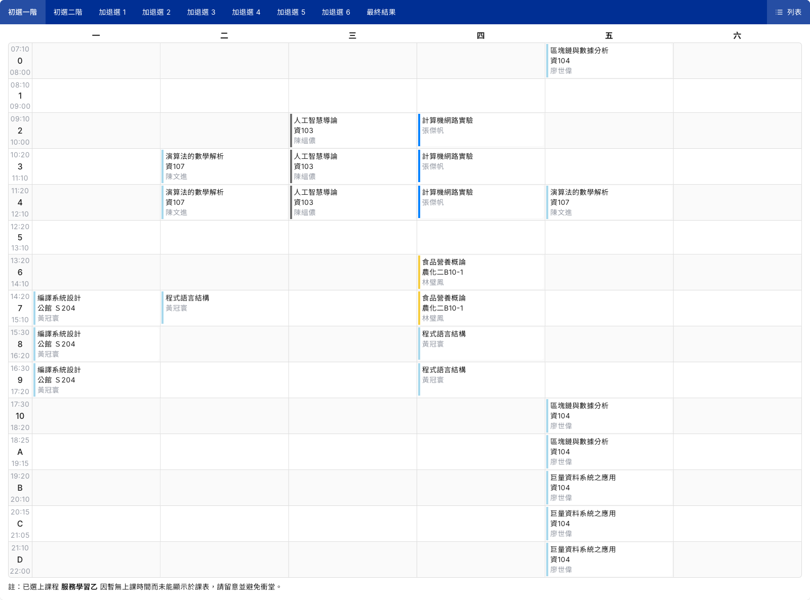
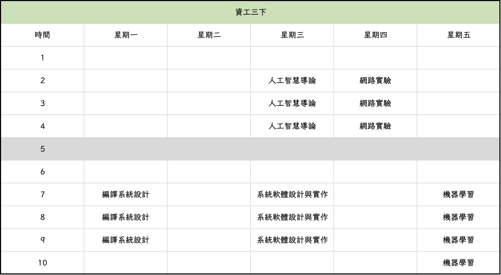

+++
title = "大三下開學札記"
description = "我如何在想修的課程間抉擇"

[taxonomies]
categories = ["Journal"]
+++

大學第三年的第二學期開學了，開學的這週一邊找專題實驗室，一邊在課程之間抉擇，是個令人煩惱的第一週。不過第一週過去之後，大致上的學期規劃都已經定下來了，不僅決定了專題實驗室、加退選了大量課程，也簡單地對課餘時間做了初步安排。

## 選課結果

時間退回 1/13 公布初選第一階段結果的這一天，當時我幸運地直接選上 22 學分，其中還有兩門只收一名臺大生的三校聯盟課程，應該是受到幸運女神的眷顧了。因為第一階段選的課對當時的我已經足夠理想，因此我沒有參與初選二階。

開學第一週，我到現場上了大部分已經選上的課，以及額外想要修的課，實際修課後課程給我的感覺和選課時不同，因此產生許多課程的變動。

先說說初選選到且被我保留下來的課，它們是必修課《人工智慧導論》、《計算機網路實驗》以及臺師大的《編譯系統設計》。前兩門課是必修所以無意外的話都會留著，而《編譯系統設計》則是我聽課後覺得不錯的課程。《編譯系統設計》這門課開在師大的公館校區，騎腳踏車過去大約需要 8 分鐘，不遠也不近，之後行程定下來後我預計從宿舍搭公車過去上課。上課的教室令我驚訝的是行動網路的訊號品質，我用手機開個網頁都需要讀取半分鐘，我又沒有權限存取師大的 Wi-Fi，後來我趕緊在上課前十分鐘申請好 **eduroam**，上課後才有網路可以用。[eduroam](https://ccnet.ntu.edu.tw/wireless/ccnet/wireless.php?page=eduroam) 是一個用學校帳號申請的服務，開通後可以在各個教育機構內連接 **eduroam** 這一個 Wi-Fi SSID 存取網路。根據老師的說法，原本是打算在師大內裝設無線基地台，但有老師反對表示蓋基地台老師會因為電磁波而死掉。（？？？）

接著是被我退選的課程，有《演算法的數學解析》、《程式語言結構》、《食品營養概論》、《區塊鏈與數據分析》及《巨量資料系統之應用》。（幸運女神的恩惠我心領了）
1. 《演算法的數學分析》是一門不錯的課，使用的教科書是 Knuth 的《Concrete Math》。根據老師的說法每週需要花 20 小時寫作業，但我實際體驗後更準確的說法應該是花 20 小時讀課本和寫作業，因為題目需要大量腦力激盪（通靈）、佔用過多時間，加上我認為學了沒有實質的幫助，所以最後退選了這門課。
2. 《程式語言結構》完全沒有到現場聽課，因為當時打算加簽另一門課，而且到師大上課有點麻煩，不想要一週去師大上兩次這門課，更是因為課程的大部分內容我之前已經學過了，所以果斷退選。
3. 《食品營養概論》的教室很難找，他在一大堆的建築中的一棟教學大樓中的地下一樓的很不起眼的一間小教室，我花了大約 10 分鐘才找到教室。老師本人的氣質很好，說話的語氣很溫和，不過對於特定情況如補考規則會有自己的堅持與底線，給我一種專業又親切的印象。退選的原因主要是需要背英文的營養學名詞，光是讓我背中文就不行了更何況是英文；此外考試的形式是線上測驗，老師表示這幾年改為線上測驗後同學的成績都變好了，讓我覺得這門課可能可以透過小手段取得高分，這不是我樂見的。
4. 《區塊鏈與數據分析》（Blockchain）及《巨量資料系統之應用》（Big Data）兩門課合稱 2B。老師給我的感覺不太正經，而且上課的時候一直扯到關於業界的話題，實際有關課程內容的比例過少，我沒有把握可以學到紮實的知識，因此最後退選了這兩門課。

最後是加簽的課，分別是《系統軟體設計與實作特論》與《機器學習》。前者探討了 Linux 內部結構以及最新系統設計，我對 Linux kernel 這一方面有興趣所以加簽了。這門課不開放初選，原本加簽這門課需要在開學前繳交 paper review，我一開始不打算加簽這門課所以並沒有交這份作業。但碰巧的是老師表示這學期是第一次使用這種加錢方式，所以額外延長了繳交期限，讓我有機會加簽這堂課，又是幸運女神的眷顧。另一門是李宏毅的《機器學習》，這門課會讓所有電資學院的學生加簽，雖然我在寒假就填好加簽表單了，不過到現在還沒收到授權碼。上課當天我有打算去教室聽課，但是因為加簽人潮過多，就算我在上課半小時前到教室外，還是沒有辦法擠進教室，最後打退堂鼓離開了。

最後選到的課如下，暫時使用我的 Excel 課表，等正式的選課結果出來後會換上課程網的課表。

總共是 15 學分，一開始 22 學分退選了 14 學分剩下 8 學分，再加簽 7 學分後才變成現在這個樣子，初選靠運氣選來的課通通吐回去，有夠揮霍運氣。

## 專題研究

這部分由於比較隱私，只能說個大概，如果有興趣了解更多可以私底下來問我。我和三位教授討論過專題研究，分別是廖世偉、洪士灝和黎士瑋（很巧的是，名字中間都唸作世）。我和廖世偉沒聊到什麼；我和洪士灝談了比較多，雖然最後沒有加入實驗室，不過教授給我了很大的啟發；和黎士瑋的約談則是下週。

由於起步較晚（已經開學了）、主題不明確且空閒時間有其他規劃，所以打算這學期找專題主題與加入研究室（主要是避免之後煩惱要找哪個研究室），大四再開始做專題。

## 課後學習

這學期只修了 15 學分的課程，因此我打算在課餘時間做點規劃，主要是打算學習關於系統安全知識，為之後的專題研究鋪路。

首先是旁聽系上的《密碼學與資訊安全》課程，目的主要是學習常見的密碼學元件以及透過實作的作業學習資安攻防的簡單技術。另外是 MIT 的 Computer Systems Security 課程，主要學習系統如何實作安全性如虛擬化等技術的簡介，規劃是跟著表定的日程表走，參與整套的課程規劃。

週日到誠品書店逛了一下，看到了新出版的比爾・蓋茲傳記，這讓我想要了解資訊界各個傳奇人物的故事，包括十年前的賈伯斯傳，學習這些先人的行事態度。

## 心得

這學期大量的加退選的過程令人難以抉擇，因為加簽和退選的課都是我想學習的課程，手心手背都是肉。然而一個人的時間與精力是有限的，如何在多門課之間做出取捨是很重要的。這學期我考量課程的所需時間成本、回報等因素來選課，學習了做出取捨所需要的心態。